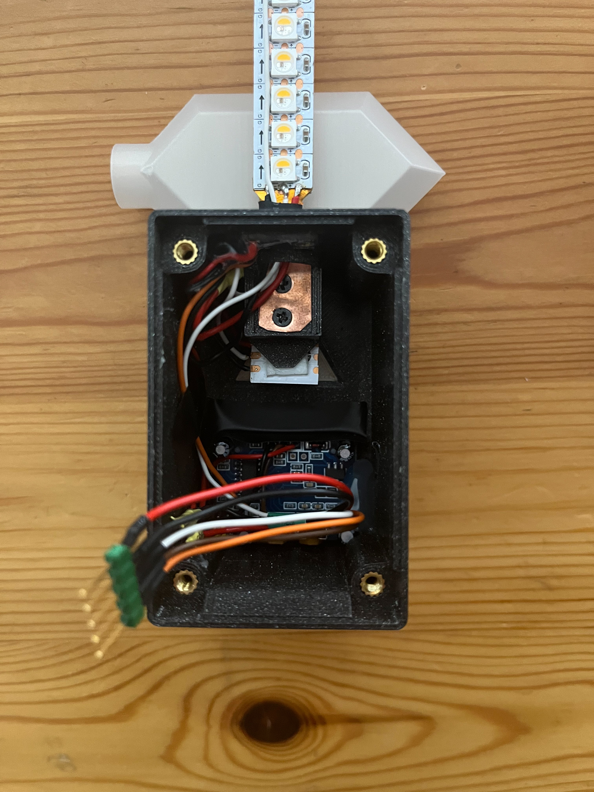
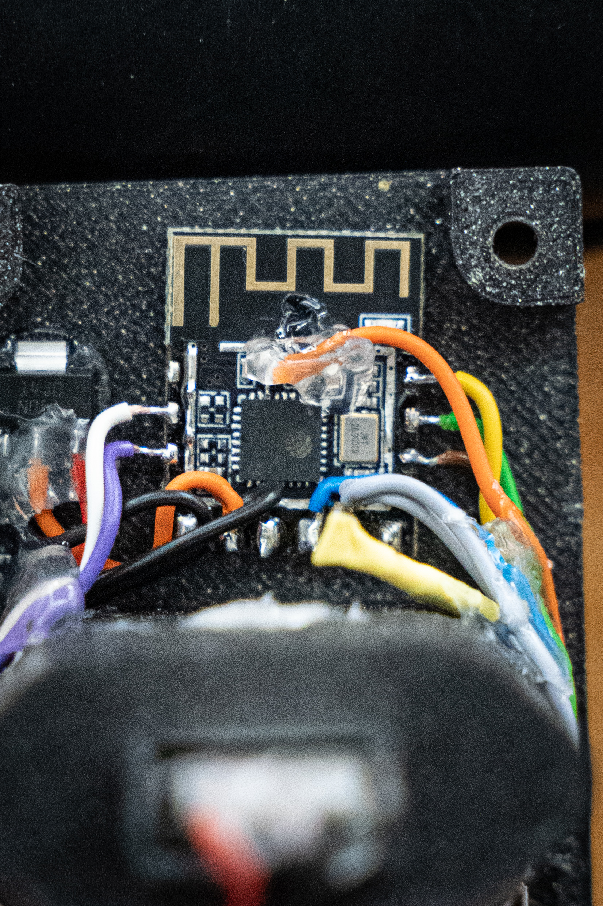

# nightlight
Firmware and 3D printing files for a DIY motionactivated nightlight in the style of Legend of Zelda.

Would i do it another way if i had more time? Yes, definitely. But even without a custom PCB and handsoldered connections this turned out pretty good.

## Instructions

The different modes can be selected via the DIP-Switches in the back of the device. In the default setting the rupee shows a random, weighted color when dark enough and motion is detected. After 4 minutes of no motion, the light is turned off.

DIP 1: Changes the Color-Mode from displaying a random rupee color to pure white when switched to the "up"-position.
DIP 2: Changes the motion timeout from 4 minutes to 8 minutes when switched to the "up"-position.
DIP 3: Activate Fallback Wifi Hotspot and [Captive Portal](https://esphome.io/components/captive_portal.html) to connect to Wifi when switched to the "up"-position.

Image of all DIP Switches in the "down"-position.

The two dails on the bottom of the housing change the sensitivity and the motion timeout bild into the PIR-Sensor. This timeout is not used and the firmware uses its own timout! The sensitivity however can be changed id needed.

## Firmware

The Firmware is created in ESPHome. The YAML-File is located in the "Software"-Folder and is intendet for use without a connected HomeAssistant Instance. The different modes can be changed via the DIP-Switches in the Back. The YAML-File can easily be modified to work this for example HomeAssistant.

## Hardware

The 3D Printing Files are also accessible on [Printables](https://www.printables.com/model/383793-legend-of-zelda-nightlight).

### Overview

The Housing consists of:
- a 3D Printed Backplate where a European 5W Charger from Apple and the ESP-M3 Microcontroller goes.
- a 3D Printed Main Housing there the LEDs, the PIR Sensor and a Light Sensor are mounted.
- 3D Printed Switch-Holding-Parts to change the Mode of the Light

The Diffusor can be inserted in the Housing and has the Style of a Rupee from the Legend of Zelda Games.

### Main Housing

The Main Housing contains the Main LED-Strip as well as 2 supplemental LEDs for the Triforce Symbol. Additionally it contains the HC-SR501 PIR-Motion-Sensor and a TEMT6000 Light Sensor. 

The Main LED-Strip consists of 6-LED-Segments of a 144 LEDs/m SK6812 RGBW Adressable LED-Strip on both its front and its back. To hold them together and mount it in the housing i used a 11mm wide copper strip. The LED signal is wired in series so the backside could be controlled seperate from the frontside. The supplemental LEDs for the Triforce Symbol are wired behind after the Main LED-Strip.

To Screw the four M3 Screws in, i positioned heat-set inserts in the screwholes in the housing. The Screws to mount the LED-Strip are of the M2 variety.

### Backplate

The Backplate is held to the housing by the four M3 Screws. The ESP-M3 Microcontroller as well as the DIP-Switches gets mounted on the backplane. The DIP-Switches are 6.6x2.7x1.4mm SMD Slider Switches from LCSC (C2911519) with carefully soldered wires going from the microcontroller GPIO to ground.

To Flash the Microcontroller the 4-Pin socket on top of the DIP-Switches can be used. From left to right the Pins are: Ground, GPIO0 (Has to be pulled to Ground to boot into Flash-Mode), RX (Goes to TX on Serial Converter) and TX (Goes to RX on Serial Converter).

To Connect the two sides the 5-Pin socket may be used. From left to right the Pins are: Lightsensor (Orange), PIR-Sensor (Brown), LED-Signal (White), Ground (Black) and +5V (Red).

### Microcontroller

Because the ESP-M3 Microcontroller doesnt expose the ADC-Pin from the ESP8266 / ESP8285 Chip the Shielding can be removed and the Signal from the Lightsensor can be soldered directly to the ADC (TOUT) Pin of the ESP.

